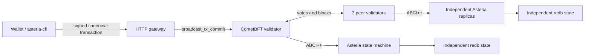

# Asteria

Asteria is a deterministic perpetual-DEX application chain written in Rust.
CometBFT provides validator networking, mempool admission, block production,
and Byzantine fault tolerant consensus. Asteria implements the ABCI++ state
machine, signed transactions, trading rules, committed state, and state root.

This repository runs a real four-validator development blockchain. It is not
production-ready infrastructure: the localnet keys, authority identity,
single-host topology, bridge model, and operational tooling are for development
and verification only.

## Consensus architecture



Every validator has an independent CometBFT home, validator key, Asteria
process, and `redb` database. No HTTP route mutates local state directly:

1. The client signs an RFC 8785 canonical JSON transaction with Ed25519.
2. The gateway submits the bytes to its paired CometBFT RPC endpoint.
3. `CheckTx` validates encoding, signature, chain ID, expiry, nonce, authority,
   numeric bounds, and the proposed transition.
4. CometBFT validators agree on transaction order and block contents.
5. `FinalizeBlock` executes deterministically on every Asteria replica.
6. `Commit` persists the snapshot before publishing its app hash.

Private-order submissions use a separate 3-of-4 Ristretto threshold key. CometBFT
vote extensions are enabled from height `1`; each Comet validator address is
bound in genesis to exactly one threshold share ID. After ordering, validators
publish verifiable partial decryptions and any three valid shares can open the
fixed-size encrypted order payload. A batch committed at `H` is shared in the
votes for `H+1` and executed by the mandatory first transaction in `H+2`.
Eligible public GTC liquidity and the reference mark are escrowed at `H`, so
transactions included after the reveal cannot enter that batch. The same vote
extensions produce a unique threshold beacon used for allocation remainders;
every valid 3-of-4 subset yields the same beacon.

Private-order admission requires `available_margin >= private_order_fee + 100`.
The non-refundable private-order fee is deducted first, then all available
margin remaining after that fee is moved into `reserved_margin` as the admission
bond. An outer signed transaction that expires before admission is rejected
without charging the fee or creating a bond. Once committed at `H`, a batch is
not silently deleted by a timeout; it must be finalized by its valid mandatory
`H+2` system transaction.

After validating the `H+2` bundle, the system transaction releases each bond
before checking decrypted private orders and frozen liquidity against the mark
risk rules. An invalid ciphertext or plaintext invalidates only that order. A
successfully completed batch removes its pending orders, bonds, committed
app-hash anchor, and frozen snapshot together. The entire transition is atomic:
if the bundle or system transaction fails, bond releases and cleanup do not
commit, and the batch remains available for deterministic retry.

With four equal-power validators the localnet continues with one validator
offline (3/4 voting power) and stops with two offline (1/2 voting power).

## Implemented state machine

- Ed25519 transactions with chain ID, nonce, expiry height, and domain separation
- Limit and protected market orders with GTC, IOC, and FOK semantics
- Price-time priority, partial fills, reduce-only orders, and self-trade prevention
- Cross-margin collateral, positions, realized/unrealized PnL, and reversals
- Maker/taker fees, funding, liquidation, non-negative insurance/fee backstops,
  and bounded deterministic social-loss accounting
- Weighted-median oracle updates with authority checks and dispersion limits
- Deterministic decimal bounds and checked consensus-critical arithmetic
- Canonical state hashing, bounded hash-linked events, runtime accounting audit, and restart recovery
- ABCI++ `InitChain`, `CheckTx`, `PrepareProposal`, `ProcessProposal`,
  `FinalizeBlock`, `Commit`, `Info`, and `Query`
- Signed fixed-size private orders, 3-of-4 verifiable threshold decryption,
  post-cutoff threshold beacon, frozen-liquidity escrow, and deterministic
  uniform-price batch execution
- InitChain enforcement of four equal-power Ed25519 validators, height-1 vote
  extensions, and exact Comet-validator-to-threshold-share bindings

## Windows four-validator localnet

Requirements: Windows PowerShell 5.1 or PowerShell 7 and Rust 1.93 or newer.
The installer downloads a checksum-pinned portable Go toolchain when Go is not
installed, then builds the pinned CometBFT Go module `v0.38.23` inside `.tools`.

```powershell
powershell -NoProfile -ExecutionPolicy Bypass -File deploy\comet\windows\Install-CometBft.ps1
powershell -NoProfile -ExecutionPolicy Bypass -File deploy\comet\windows\Start-Localnet.ps1
```

`Start-Localnet.ps1` succeeds only after all four nodes report four validators,
three peers, advancing blocks, `catching_up=false`, and the same app hash at a
common height. `Get-LocalnetStatus.ps1` also samples twice and requires the
common height to advance during its liveness window.

On first start, `asteria-private-keygen` runs a fresh four-party FROST DKG and
stores one share per node under `data\localnet\secrets\private-order`. The
directory has protected Windows ACLs for the current user and `SYSTEM`. Child
processes receive only the restricted share-file path; the Rust node reads the
share into zeroizing memory. Share contents are not written to the environment,
manifest, command line, PID records, or logs. A complete localnet reuses the same
keyset on restart. Existing or partial state without matching private-order
genesis provisioning is development-only legacy state and is rebuilt
destructively after active localnet processes have been stopped.

```powershell
powershell -NoProfile -ExecutionPolicy Bypass -File deploy\comet\windows\Get-LocalnetStatus.ps1 -RequireHealthy
powershell -NoProfile -ExecutionPolicy Bypass -File deploy\comet\windows\Stop-Localnet.ps1
```

The stop command uses exact PID plus executable/start-time records. It preserves
the chain databases, CometBFT block data, keys, genesis, and logs under
`data\localnet`. See [the Windows localnet guide](deploy/comet/windows/README.md)
for topology and operational details.

| Node | HTTP | ABCI | Comet RPC | P2P | Metrics |
| --- | ---: | ---: | ---: | ---: | ---: |
| node0 | 8080 | 26658 | 26657 | 26656 | 26660 |
| node1 | 8081 | 26758 | 26757 | 26756 | 26760 |
| node2 | 8082 | 26858 | 26857 | 26856 | 26860 |
| node3 | 8083 | 26958 | 26957 | 26956 | 26960 |

## Docker four-validator localnet

Docker Compose runs the same topology with separate named volumes for all four
application databases, all four CometBFT homes, and private-order provisioning:

```bash
docker compose -f docker-compose.blockchain.yml up --build
docker compose -f docker-compose.blockchain.yml down
```

The root `docker-compose.yml` includes this blockchain configuration, so recent
Docker Compose versions can also use `docker compose up --build`. Do not scale
an individual `appN` service: replicas of one service would share its `redb`
volume. Do not use `down -v` unless destroying the development chain is intended.
The public keyset has its own volume and each application has a separate private
share volume. Files are generated as UID `10001`; private directories use mode
`0700`, share files use `0600`, and each app mounts only its share read-only.
Each app/Comet pair has an isolated bridge, while only the four Comet processes
share the P2P bridge. Published ports bind to `127.0.0.1`. The application
receives only a mounted file path and reads the share into zeroizing Rust
memory; Compose never exports share contents as an environment variable. If old
Comet/application volumes do not match the provisioned keyset, `comet-init`
clears the managed development volumes and creates one consistent chain.
`docker compose down -v` also destroys the threshold shares, so the next start
generates a new genesis keyset and ceremony ID.

## Submit a chain transaction

The checked-in localnet authority below is development-only:

```text
account: ed25519:8a88e3dd7409f195fd52db2d3cba5d72ca6709bf1d94121bf3748801b40f6f5c
secret:  AQEBAQEBAQEBAQEBAQEBAQEBAQEBAQEBAQEBAQEBAQE=
```

Credit that account with authority nonce `0`:

```powershell
$secret = "AQEBAQEBAQEBAQEBAQEBAQEBAQEBAQEBAQEBAQEBAQE="
$account = "ed25519:8a88e3dd7409f195fd52db2d3cba5d72ca6709bf1d94121bf3748801b40f6f5c"
$height = [long](Invoke-RestMethod http://127.0.0.1:26657/status).result.sync_info.latest_block_height

$tx = cargo run --quiet --bin asteria-cli -- sign-credit `
  --secret-key $secret `
  --nonce 0 `
  --valid-until-height ($height + 1000) `
  --account-id $account `
  --amount 10000

Invoke-RestMethod http://127.0.0.1:8080/v1/admin/credits `
  -Method Post `
  -ContentType "application/json" `
  -Body ($tx -join [Environment]::NewLine)
```

The next transaction signed by that authority must use nonce `1`. Authority
commands are authorized by the consensus state machine; there is no local admin
token or direct-write bypass.

To smoke-test the private-order path, build the CLI once so signing and
broadcasting fit inside the next block window, then create the encrypted,
double-signed transaction with `sign-private-order` and submit it through the
dedicated endpoint:

```powershell
cargo build --quiet --bin asteria-cli
$cli = ".\target\debug\asteria-cli.exe"
$height = [long](Invoke-RestMethod http://127.0.0.1:26657/status).result.sync_info.latest_block_height
do {
  $nextHeight = [long](Invoke-RestMethod http://127.0.0.1:26657/status).result.sync_info.latest_block_height
} while ($nextHeight -eq $height)
$batchHeight = $nextHeight + 1

$privateTx = & $cli sign-private-order `
  --secret-key $secret `
  --nonce 1 `
  --valid-until-height ($batchHeight + 100) `
  --key-set-file data\localnet\secrets\private-order\public-key-set.json `
  --market-id BTCUSDT `
  --batch-height $batchHeight `
  --client-id smoke-private-1 `
  --side buy `
  --kind limit `
  --price-ticks 600000 `
  --quantity-lots 1 `
  --leverage 5 `
  --time-in-force ioc

$privateTx | & $cli broadcast --endpoint private-order
```

The committed account nonce advances to `2`. If another transaction already
used nonce `1`, query `/v1/accounts/{id}/nonce` and substitute the returned
nonce before signing.

Generate a separate development identity with:

```powershell
cargo run --bin asteria-cli -- keygen
```

## API

State read routes return the local replica's committed state. Transaction
lookup uses the paired CometBFT transaction index. All write routes accept a
`SignedTransaction` and broadcast it through consensus.

| Method | Path | Purpose |
| --- | --- | --- |
| `GET` | `/live` | HTTP process liveness only |
| `GET` | `/health` | Chain ID, sync, height, and app-hash agreement with paired CometBFT |
| `GET` | `/v1/chain` | Chain ID, height, app hash, and authority |
| `POST` | `/v1/tx` | Broadcast any signed Asteria transaction |
| `GET` | `/v1/tx/{hash}` | Look up a transaction and execution result in CometBFT |
| `GET` | `/v1/private/keyset` | Private-order threshold public key set and validator bindings |
| `GET` | `/v1/private/batches` | Pending encrypted private-order batches |
| `GET` | `/v1/private/batches/{height}` | Pending private-order batch at one height |
| `POST` | `/v1/private/orders` | Broadcast a signed fixed-size encrypted private order |
| `GET` | `/v1/shielded` | Development shielded-ledger root, chain domain, and accounting |
| `GET` | `/v1/shielded/commitments/{commitment}` | Commitment membership and Merkle proof |
| `GET` | `/v1/shielded/nullifiers/{nullifier}` | Nullifier spent status |
| `GET` | `/v1/shielded/markets/{market_id}` | Committed isolated-margin policy |
| `POST` | `/v1/shielded/deposits` | Broadcast an authority-backed shielded deposit |
| `POST` | `/v1/shielded/spends` | Broadcast a shielded spend |
| `GET` | `/v1/markets` | Committed markets and mark prices |
| `GET` | `/v1/markets/{symbol}/book` | Committed order book |
| `POST` | `/v1/orders` | Broadcast a signed order |
| `DELETE` | `/v1/orders/{id}` | Broadcast a signed cancellation |
| `GET` | `/v1/accounts/{id}` | Account collateral and positions |
| `GET` | `/v1/accounts/{id}/nonce` | Next committed nonce and state height |
| `GET` | `/v1/accounts/{id}/risk` | Equity, margin, and liquidation risk |
| `GET` | `/v1/events` | Most recent hash-linked committed events |
| `GET` | `/v1/ws` | Live events published after commit |
| `GET` | `/v1/audit` | State and accounting invariant audit |
| `POST` | `/v1/admin/credits` | Authority-signed collateral credit |
| `POST` | `/v1/admin/markets/{symbol}/oracle` | Authority-signed oracle update |
| `POST` | `/v1/admin/markets/{symbol}/funding` | Authority-signed funding interval |
| `POST` | `/v1/admin/shielded/markets` | Broadcast an authority-signed shielded market policy |
| `GET` | `/v1/admin/liquidation-candidates` | Accounts currently eligible for liquidation |
| `POST` | `/v1/admin/accounts/{id}/liquidate/{symbol}` | Signed liquidation command |

Consensus state retains the most recent 1,024 events. Deploy an external
indexer for archival history; the retained window remains hash-linked and its
anchor is protected by the committed application hash.

## Verification

```powershell
cargo fmt --all -- --check
cargo clippy --all-targets --all-features -- -D warnings
cargo test --all-targets
```

Tests cover canonical encoding, signatures, replay protection, deterministic
state roots, proposal validation, persistence failure behavior, numeric overflow
rejection, panic rollback, matching, margin, oracle, liquidation, HTTP consensus
broadcasting, and restart recovery.

## Production gaps

- Truly distributed FROST DKG/refresh with authenticated broadcast,
  confidential peer channels, secure validator provisioning, and HSM integration
- Multi-machine deployment, sentry topology, backups, snapshots, and state sync
- Validator governance, upgrades, evidence handling, and slashing policy
- Production bridge/finality verification and custody
- External security audit, load testing, observability, and incident procedures
- ADL or socialized-loss policy after insurance-fund exhaustion
